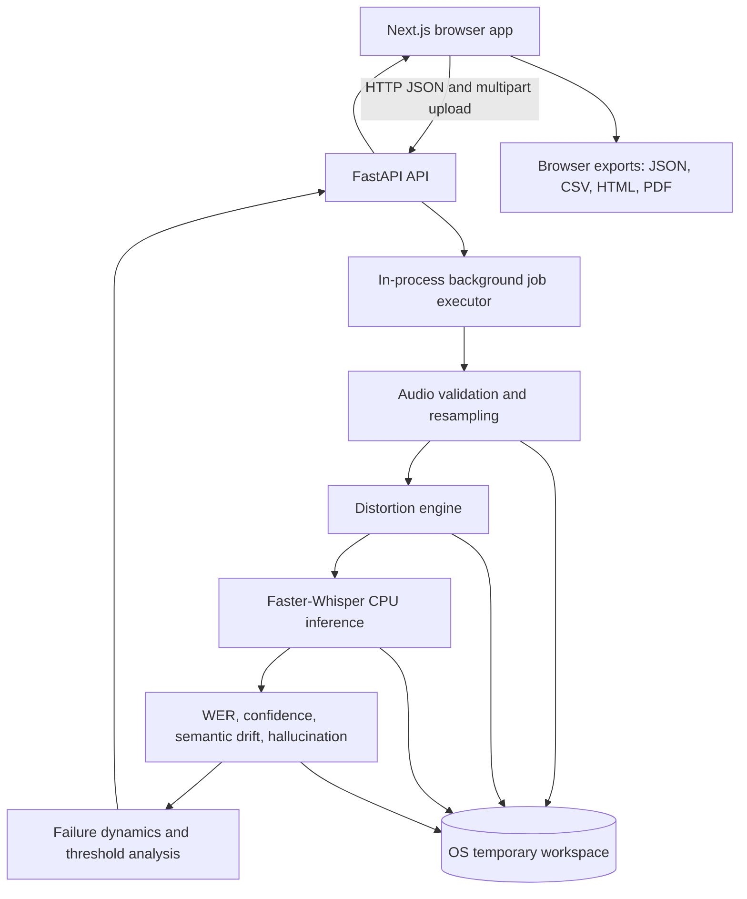
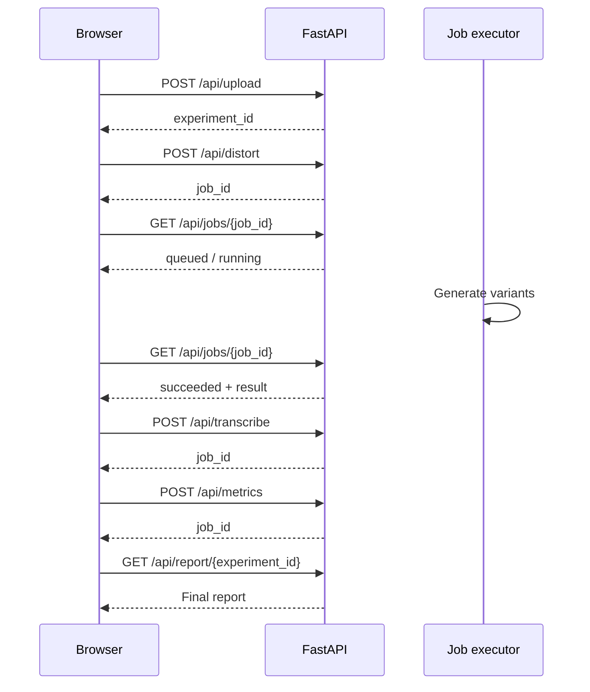
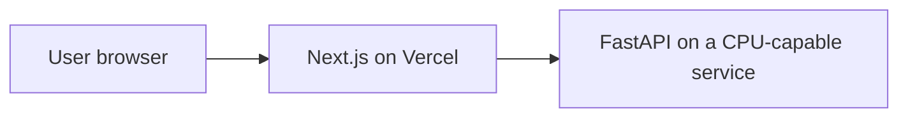

# Audio Illusion Laboratory

> **An instrument for watching machine hearing fail.**

Audio Illusion Laboratory is a research-oriented web application for measuring
how automatic speech-recognition systems degrade when an otherwise clean audio
sample is pushed through controlled distortions.

It uses [Faster-Whisper](https://github.com/SYSTRAN/faster-whisper) for local
CPU transcription, then compares the clean baseline against progressively harsher
variants. The result is not simply a transcript. It is a visual record of the
model moving from reliable perception to drift, hallucination, and collapse.

**Current status:** working research prototype. The application runs locally,
uses temporary processing files, and exports findings directly from the browser.

---

## Why This Exists

Speech-recognition systems can produce fluent text after the audio signal has
already become unreliable. That makes ordinary accuracy scores incomplete: a
model may be wrong while sounding confident.

This project turns that failure into an observable experiment. For one uploaded
sample, it creates an intensity ladder of distorted audio, transcribes every
variant, computes multiple metrics, and presents the trajectory as an analytical
report.

This **is**:

- A controlled ASR robustness experiment tool.
- A distortion sweep and failure-threshold observatory.
- A visual instrument for comparing confidence, WER, semantic drift, and
       hallucination behavior.
- A local-first research prototype with no paid inference APIs.

This is **not**:

- A production transcription or captioning service.
- A real-time speech system.
- A model-training or fine-tuning pipeline.
- A guarantee that a transcript is correct because the model sounds confident.

---

## The Five Failure Stages

As distortion intensity rises, the model is classified into five stages:

| Stage | Meaning | Typical signal |
| --- | --- | --- |
| **1. Stable Perception** | The output remains essentially correct. | Low WER, high confidence, low drift |
| **2. Perceptual Drift** | Small word-level errors appear, but meaning survives. | WER rises, confidence begins to dip |
| **3. Semantic Drift** | Errors begin to change the meaning of the utterance. | Drift increases, preservation falls |
| **4. Hallucination** | The model emits confident content not supported by the input. | Hallucination score crosses the threshold |
| **5. Perceptual Collapse** | Output becomes empty, repetitive, or incoherent. | Confidence < 25 and WER > 60% |

The two headline findings are:

- **Hallucination threshold:** the first distortion level where the
       hallucination score crosses `0.4`.
- **Perception collapse point:** the first level where confidence falls below
       `25` while WER exceeds `60%`.


---

## What You Can Do

### Run an experiment

1. Upload a WAV, MP3, FLAC, OGG, or M4A file up to 120 seconds.
2. Choose one or more distortion families.
3. Choose a standard six-level or extended nine-level intensity ladder.
4. Generate variants and run local Faster-Whisper inference.
5. Inspect the dashboard, transcript evolution, hallucination observatory, and
       final report.

### Study the findings

- Compare the failure path of every distortion.
- Inspect the exact level where hallucination begins.
- See confidence collapse beside WER and semantic drift.
- Review transcript differences at each level.
- Compare the most dangerous and most robust distortions.

### Export the report

The final report can be saved directly from the browser as:

- **JSON** for complete structured report data.
- **CSV** for spreadsheet and statistical analysis.
- **HTML** as a self-contained document with inline charts.
- **PDF** through the browser print dialog, preserving the rendered graphs.

The backend keeps experiment artifacts in the operating system temporary
directory. They are automatically removed after the retention window, so export
the report before leaving the experiment if you need to keep it.

---

## Distortion Families

| Distortion | What changes |
| --- | --- |
| **White noise** | Adds controlled noise relative to the signal standard deviation. |
| **Echo** | Adds delayed, decaying reflections. |
| **Compression** | Applies quantization and companding artifacts. |
| **Pitch shift** | Moves pitch by progressively larger semitone offsets. |
| **Speed shift** | Changes playback speed using time stretching. |
| **Combined** | Stacks multiple perturbations into a compound failure condition. |

Level `0` is always the clean baseline. The extended ladder resamples each
distortion's native parameter range while preserving its clean and maximum
endpoints.

---

## Metrics

### Word Error Rate (WER)

$$
WER = \frac{S + D + I}{N}
$$

Where `S` is substitutions, `D` is deletions, `I` is insertions, and `N` is
the number of words in the clean reference transcript. WER can exceed `1.0`
when insertions are high.

### Confidence score

Faster-Whisper segment log probabilities are aggregated and mapped to a `0-100`
confidence score. This is a model-reported signal, not proof of correctness.

### Drift index

Cosine distance between sentence embeddings of the clean reference and the
variant transcript. Higher drift means less semantic preservation.

### Semantic preservation

`1 - drift_index`, clamped to the `0-1` range.

### Hallucination score

A semantic-distance signal gated by high WER. The gate prevents ordinary small
transcription mistakes from being reported as fabricated content.

### Collapse detection

Collapse is detected when both conditions are true:

```text
confidence < 25
AND
WER > 0.60
```

---

## Architecture



### Technology stack

| Layer | Technology |
| --- | --- |
| Frontend | Next.js 14 App Router, React 18, TypeScript |
| Styling | TailwindCSS, custom editorial design tokens |
| Visualization | Plotly, React Plotly, Framer Motion |
| Backend | FastAPI, Uvicorn, Pydantic |
| ASR | Faster-Whisper, CPU-first configuration |
| Audio | librosa, soundfile, scipy, pydub |
| Metrics | jiwer, sentence-transformers, NumPy |
| Runtime storage | OS temporary directory with automatic cleanup |

### Request lifecycle

Heavy stages return a job envelope immediately. The frontend polls the job until
it reaches `succeeded` or `failed`, so long CPU operations do not occupy one HTTP
request for their entire duration.



---

## Run Locally

### Prerequisites

- Python 3.10 or newer.
- Node.js 18 or newer.
- `ffmpeg` available on `PATH` for formats that require external decoding.
- Internet access on first run to download the Whisper and embedding models.

### 1. Start the backend

From PowerShell on Windows:

```powershell
cd backend
python -m venv .venv
.\.venv\Scripts\Activate.ps1
python -m pip install --upgrade pip
pip install -r requirements.txt
uvicorn main:app --reload --host 127.0.0.1 --port 8000
```

From macOS or Linux:

```bash
cd backend
python3 -m venv .venv
source .venv/bin/activate
python -m pip install --upgrade pip
pip install -r requirements.txt
uvicorn main:app --reload --host 127.0.0.1 --port 8000
```

Verify the API at <http://127.0.0.1:8000/health> or open the interactive docs
at <http://127.0.0.1:8000/docs>.

### 2. Start the frontend

```bash
cd frontend
npm install
```

Create `frontend/.env.local` from the example:

```env
NEXT_PUBLIC_API_URL=http://127.0.0.1:8000
```

Then start Next.js:

```bash
npm run dev
```

Open <http://localhost:3000>.

### One-command Windows launcher

The repository also includes a PowerShell launcher that creates the virtual
environment, installs dependencies, starts both servers, waits for the backend,
and opens the browser:

```powershell
powershell -ExecutionPolicy Bypass -File .\run.ps1
```

Use `-SkipInstall` after the first setup:

```powershell
.\run.ps1 -SkipInstall
```

---

## Configuration

### Backend variables

| Variable | Default | Purpose |
| --- | --- | --- |
| `WHISPER_MODEL` | `base` | Faster-Whisper model size. |
| `WHISPER_DEVICE` | `cpu` | Inference device. |
| `WHISPER_COMPUTE_TYPE` | `int8` | CPU-friendly compute mode. |
| `EMBEDDING_MODEL` | `all-MiniLM-L6-v2` | Sentence-transformer model for semantic drift. |
| `TEMP_DIR` | System temp directory | Temporary experiment workspace. |
| `TEMP_RETENTION_SECONDS` | `900` | Cleanup delay after report generation. |
| `MAX_AUDIO_DURATION` | `120` | Maximum audio length in seconds. |
| `MAX_UPLOAD_BYTES` | `26214400` | Maximum upload size, 25 MiB. |
| `JOB_WORKERS` | `1` | In-process background worker count. |
| `CORS_ORIGINS` | `http://localhost:3000` | Comma-separated allowed frontend origins. |

### Frontend variables

| Variable | Default | Purpose |
| --- | --- | --- |
| `NEXT_PUBLIC_API_URL` | `http://127.0.0.1:8000` | FastAPI base URL. |

---

## API Overview

All API routes are mounted below `/api`.

| Method | Endpoint | Purpose |
| --- | --- | --- |
| `POST` | `/api/upload` | Validate and create a temporary experiment. |
| `POST` | `/api/distort` | Queue distortion variant generation. |
| `POST` | `/api/transcribe` | Queue clean and variant transcription. |
| `POST` | `/api/metrics` | Queue metric computation. |
| `GET` | `/api/jobs/{job_id}` | Read queued, running, succeeded, or failed job state. |
| `GET` | `/api/transcript/{experiment_id}` | Read saved temporary transcripts. |
| `GET` | `/api/metrics/{experiment_id}` | Read computed metrics. |
| `GET` | `/api/timeline/{experiment_id}` | Read the per-level failure timeline. |
| `GET` | `/api/hallucination/{experiment_id}` | Read thresholds and word-level hallucination analysis. |
| `GET` | `/api/report/{experiment_id}` | Assemble and return the complete report. |
| `DELETE` | `/api/report/{experiment_id}` | Immediately remove temporary experiment artifacts. |

The processing endpoints return a job envelope similar to:

```json
{
       "job_id": "a723a1e1-9aed-417f-821c-8602aee4da43",
       "kind": "distort",
       "status": "queued",
       "progress": 0.0,
       "result": null,
       "error": null
}
```

---

## Repository Layout

```text
.
├── backend/
│   ├── analysis/       Failure stages, thresholds, and trajectories
│   ├── api/            FastAPI routes, schemas, security, and job status
│   ├── audio/          Loading, validation, and 16 kHz resampling
│   ├── distortions/    Noise, echo, compression, pitch, speed, combined
│   ├── metrics/        WER, confidence, semantic drift, hallucination
│   ├── reports/        Experiment report generation
│   ├── whisper/        Faster-Whisper engine and confidence extraction
│   ├── config.py       Environment-driven scientific/runtime settings
│   ├── jobs.py         Lightweight in-process background executor
│   └── main.py         FastAPI application entrypoint
├── frontend/
│   ├── src/app/        Landing, experiment, dashboard, observatory, report
│   ├── src/components/ Shared UI and chart components
│   ├── src/hooks/      Experiment state and polling hooks
│   ├── src/services/   Typed API client
│   └── src/types/      Frontend API contracts
├── README.md
├── run.ps1             Windows development launcher
└── backend/requirements.txt  Backend dependencies
```

---

## Deployment Notes

The frontend and backend can be deployed separately:



For a public prototype, Vercel is a good frontend host. A free Render service
or Hugging Face Space can be used for experimentation, but expect cold starts,
limited CPU/RAM, sleeping services, and ephemeral filesystems.

Before treating this as a production service, replace or extend the current
prototype runtime with:

- A durable queue such as Redis/RQ, Celery, Modal, or a managed job runner.
- Object storage if users need saved experiment history.
- Authentication, rate limiting, and per-user isolation.
- A persistent database for experiment metadata.
- Pinned dependency versions and a container image with `ffmpeg` installed.
- Readiness checks that verify the Whisper and embedding models are available.

The current design deliberately avoids persistent storage: reports are meant to
be exported by the user and temporary artifacts are cleaned up automatically.

---

## Development Commands

```bash
# Frontend development server
cd frontend && npm run dev

# Frontend production build
cd frontend && npm run build

# Frontend production server
cd frontend && npm run start

# Backend development server
cd backend && uvicorn main:app --reload --port 8000
```

The frontend production build currently compiles all application routes:
landing, experiment setup, dashboard, observatory, and report.

---

## Research Caveats

- The clean level-0 transcript is used as the reference when no ground-truth
       transcript is supplied.
- Semantic drift is model-based and should be interpreted as a comparative
       signal, not an objective human judgment of meaning.
- CPU inference is intentionally supported, but longer audio and extended
       ladders can take significant time.
- The in-process job executor is suitable for one backend process only. Jobs are
       lost if that process restarts.
- This tool studies failure behavior; it should not be used as the sole safety
       check before deploying an ASR system.

---

## License

No license has been declared in this repository yet. Add a license before
accepting external contributions or redistributions.
